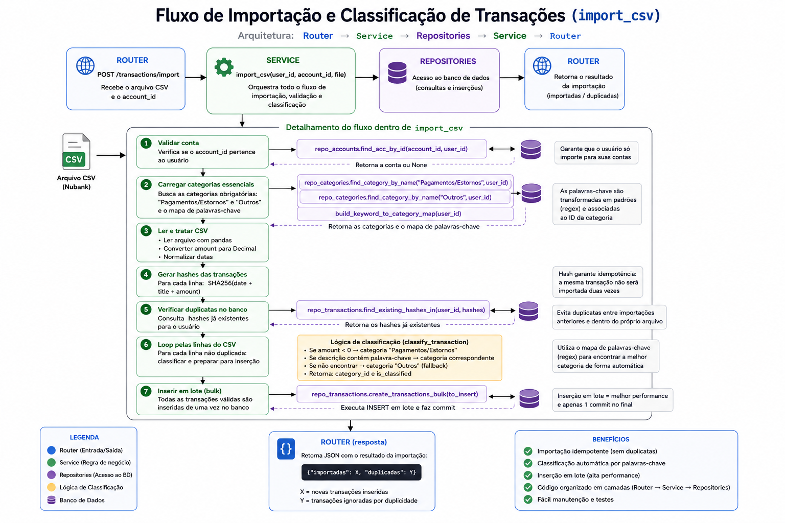

# Finance Tracker

A backend API for personal finance management, built with FastAPI and PostgreSQL, following a layered architecture (router -> service -> repository). The project handles accounts, categories, and transactions, with support for automatic CSV statement import (Nubank format), preventing duplicate records through deterministic hashing.

Built as a portfolio project with a focus on solid backend engineering practices: secure authentication (JWT/OAuth2), IDOR protection, versioned migrations with Alembic, and data validation with Pydantic.

## Table of Contents

- [Features](#features)
- [Tech Stack](#tech-stack)
- [Architecture](#architecture)
- [How to Use](#how-to-use)
- [Next Steps](#next-steps)
- [Motivation](#motivation)

## Features

- JWT/OAuth2 authentication
- Accounts CRUD (with IDOR protection)
- Categories CRUD (with is_default guard)
- Automatic category classification with regex
- Transactions with deduplication via hash
- CSV import (Nubank) via pandas
- Spending and income dashboard, including a breakdown by category, updated automatically when a category is changed or a transaction is deleted/classified

## Tech Stack

FastAPI · SQLAlchemy · Pydantic · PostgreSQL · Uvicorn · uv · Alembic · pandas · regex · Streamlit

<details>
<summary>Full dependency list</summary>

```
Python              3.13.9
alembic             1.19.0
bcrypt              4.0.1
passlib             1.7.4
email-validator     2.3.0
fastapi             0.138.1
jinja2              3.1.6
pandas              3.0.5
pydantic            2.13.4
python-jose         3.5.0
sqlalchemy          2.0.51
starlette           1.3.1
streamlit           1.61.1
uv                  0.11.25
uvicorn             0.49.0
```
</details>

## Architecture

The project follows a 4-layer architecture.

The **router** is responsible for all HTTP requests, input validation, response models, and status codes. It makes a call to the **service**, which is responsible for all the business logic.

The service calls the **repository** functions, responsible for the database queries. Back in the service, the data is modeled and adjusted according to the business logic, and finally saved to the database and returned to the router completing the HTTP request cycle.

JWT and authentication functions, along with the classes that return status codes and error messages, live in the 4th layer, **core**, which holds everything that isn't business logic.

### Auth

Responsible for the user's JWT authentication: password/username changes, login, and signup. IDOR protection is handled through get_current_user, which decodes the JWT from the request header to get the user's information and checks whether it matches the requester. Sensitive information lives in .env, read through Pydantic v2, which loads and assigns each field to the settings object automatically. These functions and classes live inside the core folder.

### Accounts

Used to assign each list of transactions to a corresponding account for the user multiple accounts can be created and removed. Removing an account cascades, removing everything tied to that account along with it. Full CRUD, with foreign keys scoped to the user.

### Categories

A pre-configured, fixed dictionary applied to every user at account creation, used as the basis for automatic classification.

### Transactions

Processed based on the data provided in the Nubank CSV upload. When a file is uploaded, each transaction description is checked against the category dictionary: if there's a match, it's automatically classified by category_id and flagged is_classified=True, if not, it falls into "Outros" Everything is collected into a list and committed to the database in a single write at the end. Transactions can also be created and recategorized manually.


## How to Use

Run the backend and frontend in two separate terminals:

```bash

# Backend
uvicorn main:app --reload
```

```bash

# Frontend
streamlit run UI/app.py
```

1. Create an account and log in with your username and password.
2. Go to the **Transactions** tab and upload your CSV — the dashboards are generated automatically.
3. On the main tab, review the charts and categorizations to self-evaluate your spending and define savings and financial management strategies.

## Next Steps

Finance Tracker v2 will feature a much smarter, more automated classification system using Machine Learning, applying concepts from Andrew Ng's Machine Learning Specialization (Stanford Online) plus agents powered by free LLM models to help find specific data and answer user questions. The overall flow will be further automated, with additional features on top.

## Motivation

My inspiration for building this project was to solve a real problem at home: financial analysis, done in a completely free way, that would also help me understand backend architecture. Beyond being able to better analyze spending and gain more individual control over expenses, this was an excellent project for understanding architecture, programming logic, database constraints, Alembic, and for solidifying my knowledge of JWT and error handling.